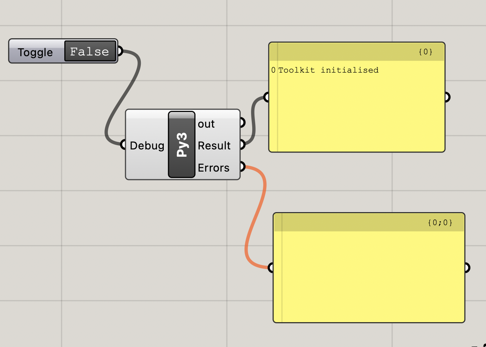

# gh-parametric-toolkit

Studio-ready computational design tools built for **Rhino 8** using **Grasshopper** and **CPython (Python 3)**.  
This repository focuses on **modular, readable, and extensible code** that supports early-stage design exploration, rationalization, and sustainability-informed workflows in the AEC industry.

Grasshopper definitions act as **thin UI layers**, while core logic lives in reusable Python modules to support maintainability, testing, and team adoption.

## Python-first User Objects

This toolkit is distributed as **Grasshopper User Objects** rather than compiled plugins.

The tools are developed primarily in **Python**, a language that is widely used and accessible within the architectural and computational design community. Python allows the logic to remain readable, adaptable, and easy to extend—both for the author and for architects who may want to understand or customize the workflows.

Using User Objects helps keep the toolkit:

- **Open source and transparent**, with no black-box components
- **Approachable for architects**, even without formal software engineering backgrounds
- **Easy to adapt and extend** within Grasshopper
- **Low-friction to deploy** in professional environments

This Python-first, User Object–based approach prioritizes clarity, learning, and flexibility, while leaving room for future evolution if more specialized tooling is needed.

---

## Compatibility

- Rhino 8
- Grasshopper
- CPython (Python 3)
- macOS / Windows

---

## Local Setup

This toolkit requires an **environment variable** pointing to the local path of the
`gh-parametric-toolkit` repository so that Grasshopper CPython components can import
the project modules.

### macOS

1. Open **Terminal**
2. Set the environment variable:
   ```bash
   export GH_PARAMETRIC_TOOLKIT="/Users/YOURNAME/Documents/YOURFOLDER/gh-parametric-toolkit"
   ```
3. Launch Rhino from same Terminal window:
   ```bash
   open -a "Rhino 8"
   ```
4. Open `initialise_toolkit.gh` in Grasshopper

### Windows

1. Open **Command Prompt**
2. Set the environment variable:
   ```bat
   set GH_PARAMETRIC_TOOLKIT=C:\Users\YOURNAME\Documents\YOURFOLDER\gh-parametric-toolkit
   ```
3. Launch Rhino from the same Command Prompt window:
   ```bat
   "C:\Program Files\Rhino 8\System\Rhino.exe"
   ```
4. Open `initialise_toolkit.gh` in Grasshopper

---

## Initialise Toolkit (Setup Check)

`initialise_toolkit.gh` is a setup and diagnostic tool.

It does not configure the toolkit permanently.
Instead, it checks that:

- Rhino was launched correctly
- the toolkit path is available
- Python modules can be imported

You can open this file at any time to verify that your setup is working.
All other tools perform their own checks automatically.

### If it works

You should see:
`Toolkit initialised`


### If it does not work

- Make sure Rhino was launched from Terminal / Command Prompt
- Ensure the environment variable is set as described above
